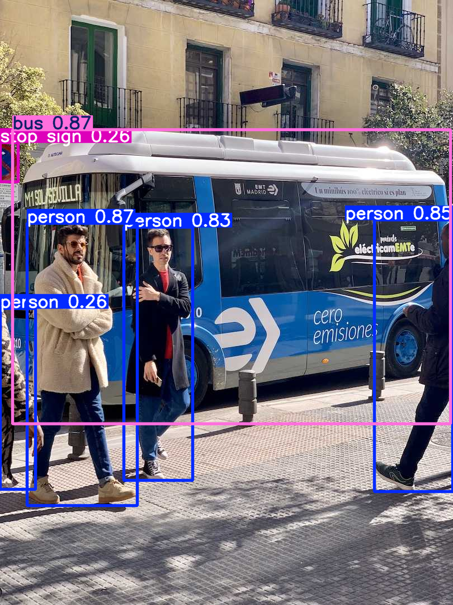
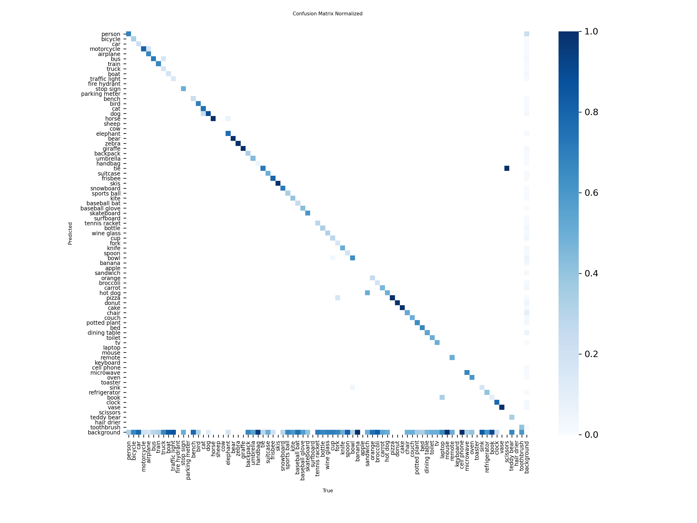
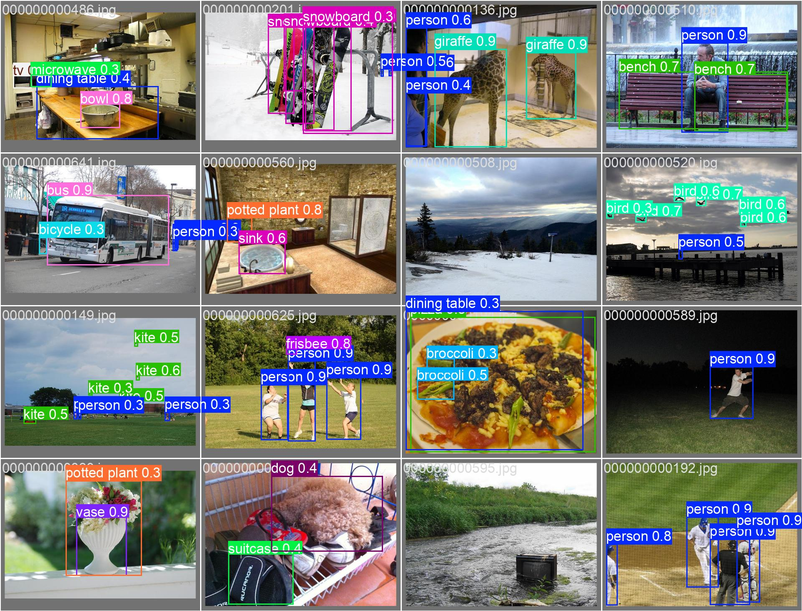

# YOLOv8 Object Detection Project

This project implements an **object detection pipeline** using **YOLOv8**, a state-of-the-art real-time object detection model. The goal is to detect multiple objects in images with high accuracy while keeping inference lightweight and fast.

## Model and Architecture
- The project uses the **YOLOv8n** model (nano version), which is part of the YOLOv8 family.
- YOLOv8 is a **single-stage detector** with a CSP (Cross Stage Partial) backbone and PANet neck for feature aggregation.
- It uses **anchor-free detection heads** and advanced training strategies for improved speed and accuracy.
- The architecture balances **efficiency and performance**, making it suitable for real-time applications.

## Dataset
- The model was trained and evaluated on the **COCO128** dataset, a small subset of the COCO dataset for fast experimentation.
- The dataset includes **128 images** and **multiple object classes** such as person, car, bicycle, and more.
- For custom use cases, the `data.yaml` can be updated with paths to your own images and class names.

## Results
- The trained model achieves competitive detection results on COCO128, with metrics including:
  - Precision, Recall
  - mAP50 and mAP50-95 for each class
- Example results (tables and visualizations) are provided as images in the repository.

